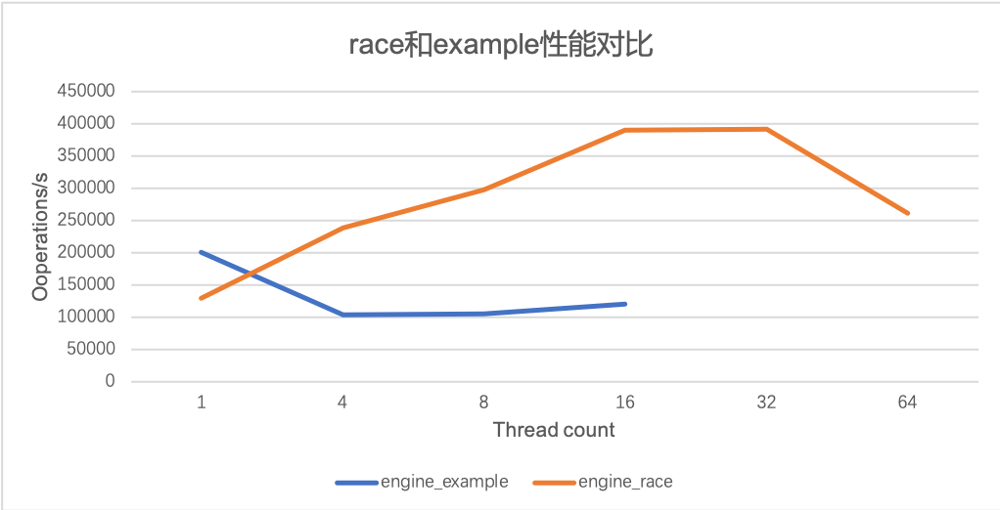

# KV Engine 报告

陶天骅 2017010255 计81

## 运行

在`engine`目录下，`make`生成`libertine.a`，然后可以进行test和bench。

实现的文件

```bash
engine_race/engine_race.cc
engine_race/engine_race.h
engine_race/util.h
```

## 设计

### 文件类型

KV系统中有三种文件。

data: 保存所有的 value，每次Write()时append到文件末尾。

index.tmp: 在每次调用KV系统的Write()的时候，会把(1) key size (2) key (3) value在data文件中的位置写入到文件末尾，以保证若KV系统奔溃，下次可以从此文件中恢复出来数据。

index: 文件index.tmp中的内容是有重复的，因为后面写入的内容可能使前面写入的无效，因此通过读index.tmp来重建索引会很慢，index文件是去除重复和无效索引之后的内容，在每次engine析构的时候写该文件。

### 运行流程

1. Open. 
   1. 检查目录下是否存在index.tmp文件，若存在，说明上一次engine没有正常关闭（正常关闭会删除tmp文件），则读取index.tmp文件中的内容到内存中的hash_map，然后再读取index中的内容到hash_map中；若没有index.tmp文件，就直接读取index文件。若index和index.map都不存在，则是新目录。
   2. 构建完hash_map，内存内的索引就构建完了。index.tmp文件已经没有用，删去。然后新建8个新的index.tmp文件，并开启mmap
2. Read. 根据key得到桶 i ，查询hash_map获得location，根据location去硬盘上对应的data_i中的位置读出value。
3. Write. 根据key得到桶 i ，更新hash_map中的索引，然后把value写到data_i文件的末尾。之后通过memcpy把（key，keysize，location）通过mmap写到index.tmp中。
4. Close. 正常的关闭过程。先把hash_map中的内容写到index文件中，然后删除所有的index.tmp文件。

### 主要思路

把key和value分开存储，把索引保存在内存里，使用hashmap从key得到索引，再根据索引去读文件获得value。

为了提高性能，增加并发性，设置8个bucket，data文件和index.tmp文件也有8份，即data_0, data_1, data2等。每个key对应到8个中的1个，每个bucket都可以允许1个线程进行读或写。每个bucket都配一个mutex。

bucket的数量可以设为更多，比如说64个，但是这样就有64个 data_i, index_i.tmp文件，每次open和close的时候，都会很慢（要创建或者删除文件），而且在核数不太多的电脑上，设置更多的bucket没有明显的性能提升。

## 实现细节

Location类：

```c++
struct Location
{
    size_t offset;  // byte offset in file
    size_t len;     // byte length of the data string
};
```

hash_map具体是std::unordered_map<std::string, Location>.

## 性能测试

把实现的engine_race和模版engine_example比较。（在分配的服务器上，srun -n1 -c 8 ./bench x 50 0）

可以看到随着访问线程数增加，engine_example性能是下降的，而我的engine_race有性能提升，在16个线程的时候吞吐较高，在64个线程的时候，性能下降，因为线程调度频繁，访问锁也频繁

| Thread_cnt | op/s (engine_example) | op/s (engine_race) |
| ---------- | --------------------- | ------------------ |
| 1          | 200399                | 103556             |
| 4          | 103556                | 238797             |
| 8          | 105478                | 298422             |
| 16         | 120461                | 390930             |
| 32         | /                     | 391170             |
| 64         | /                     | 260679             |

对应图表



性能随分布和读写比例变化。

当读操作更多的时候，性能更高。

| read ratio                | 10     | 50     | 90     |
| ------------------------- | ------ | ------ | ------ |
| Op/s (8 threads, uniform) | 252241 | 298422 | 630911 |
| Op/s (8 threads, skew)    | 243719 | 288505 | 496513 |

操作时间主要花在把value写到data文件，和把索引写到index.tmp文件中。每次启动和关闭的时候，创建和删除文件会比较慢，但是read和write会更快，而且它们都是O(1)的。

## 正确性测试

通过。

```bash
[a2017010255@storage test]$ ./run_test.sh 
======================= single thread test ============================
open engine_path: ./data/test-1654828927800171
======================= single thread test pass :) ======================
--------------------------------------
======================= multi thread test ============================
open engine_path: ./data/test-1654837943067366
======================= multi thread test pass :) ======================
--------------------------------------
======================= crash test ============================
open engine_path: ./data/test-1654855137779673
======================= crash test pass :) ======================
```

## 思考题

