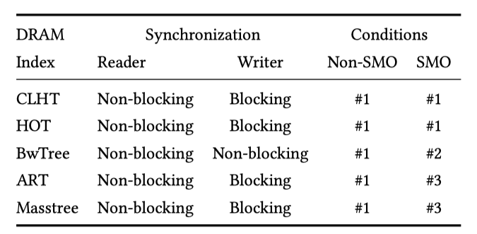
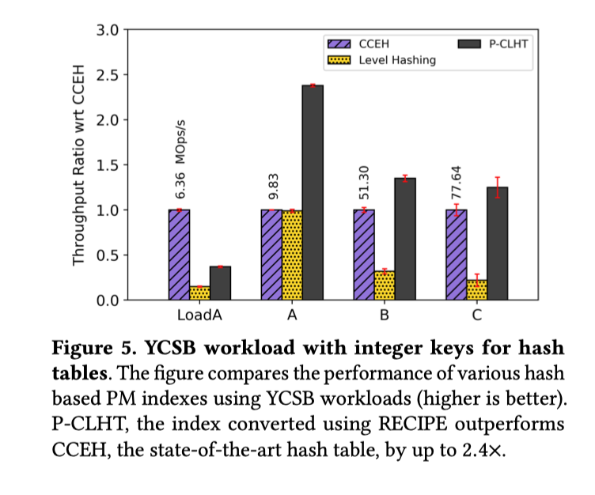

## RECIPE : Converting Concurrent DRAM Indexes to Persistent-Memory Indexes

陶天骅 2017010255

主要思想：由NVM与DRAM的相似性，我们可以把以前为DRAM设计的索引结构，比如哈希表、B+树、Trie、Radix树，移植到NVM上。然而由于NVM上的数据可以持久保存，为NVM设计的数据结构需要考虑崩溃一致性。文章发现可以通过对崩溃一致性进行小的更改来转换由特定类别的并发内存索引提供的隔离。文章针对三种情况提出了三条方法。

实验部分：评估了英特尔DC永久内存上转换后的PM索引，发现它们在多线程工作负载中的性能优于最新的手工PM索引，最高可达5.2倍。

### 要点（根据在文章中出现的先后）

RECIPE，这是一种原则性的，实用的方法，用于将并发DRAM索引转换为持久的，崩溃一致的NVM索引。

RECIPE只能应用于满足特定条件的DRAM索引，并且转换过程因匹配条件而异。

RECIPE的基本想法是并发DRAM索引中的隔离与持久性索引中的崩溃一致性密切相关。

RECIPE的好处：首先，它大大降低了构建PM索引的复杂性；开发人员只需选择合适的DRAM索引并按照我们的方法进行修改即可。即使存在并发写入，开发人员也不必担心崩溃恢复。其次，如果开发人员转换具有高性能和可伸缩性的DRAM索引，则转换后的PM索引无需任何进一步优化即可提供良好的性能。

#### 关于DRAM索引

有这些操作

- insert(key, value)
- update(key, value)
- lookup(key)
- range_query(key1, key2)
- delete(key)

#### 关于Concurrency 和 Isolation：

- 阻塞操作：确保并发索引正确性的最简单方法是获得索引的锁
- 非阻塞操作：非阻塞操作的进度保证，可以将它们分为无锁和无等待操作。无锁操作允许多个线程同时访问共享对象，同时确保这些操作中的至少一个在有限数量的步骤后完成。无等待操作是无锁操作的子集，其附加条件是每个线程都以有限数量的步骤完成操作。

#### PM索引的好处：

- 在接近DRAM延迟的情况下，更大的PM容量允许使用更大的索引
- 崩溃后需要重建DRAM索引。对于大索引，重建可能需要几分钟或几小时。相反，PM索引立即可用。

#### RECIPE只能应用于符合以下三个条件之一的DRAM索引

针对三种情况提出了三条方法。

Condition #1: Updates via single atomic store

方法1：若更新操作是通过单个的原子写进行，可直接在每个写的后面加上flush（缓存刷除）操作，并通过fence将原子写操作与其他操作隔离开，保证这些写操作完成的顺序（如下图）。通过这种转化，便可在索引结构从DRAM转化到NVM时，保证崩溃一致性。

eg: Height Optimized Trie (HOT) && Cache-Line Hash Table

Condition #2: Writers fix inconsistencies

方法2：条件1)  读者和写者均是非阻塞的，这意味着它们均使用原子指令，而非被锁保护。2）索引结构中的写操作，需要由一系列有顺序的原子写组成。3)  当读者可以观察到不一致状态的时候（比如一系列的原子写中，只有前几个原子写被完成了），可以检测到并容忍这些不一致。4)  当（另外一个）写者检测到不一致状态的时候，可以通过帮助机制来修复不一致状态（比如需检测到这一系列原子写被完成到了哪一步，并可以从这一步开始，将之后的一系列原子写操作继续做完）。

eg: BwTree

Condition #3: Writers don’t fix inconsistencies

方法3：方法3和方法2的条件类似，不同之处在于，写者由锁进行保护。在被锁保护的情况下，DRAM索引中的写者是没有机会看到不一致的状态的。因此，这种条件下的写者在DRAM实现中并没有修复不一致性的能力。方法3所涉及到的修改量是最大的。

eg: Adaptive Radix Tree

#### Evaluation

这里主要是结果

在多线程YCSB工作负载上，RECIPE转换后的索引比最先进的手工PM索引高出5.2倍。配方转换的索引是根据成熟的DRAM索引构建的，因此针对缓存效率和并发性进行了优化。与手工制作的PM索引相比，配方转换的索引遇到的缓存丢失更少。与手工制作的PM索引（例如FAST＆FAIR）相比，像P-ART这样的索引的仅附加性质导致缓存行刷新减少多达2倍。所有这些因素都有助于提高基于配方的PM索引的性能。

