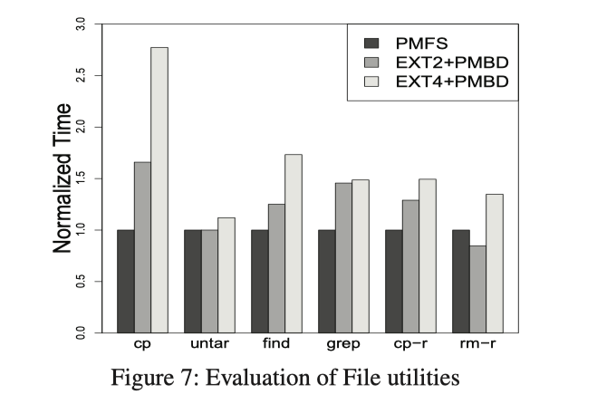
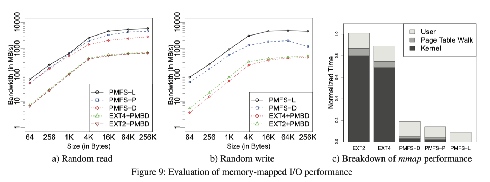
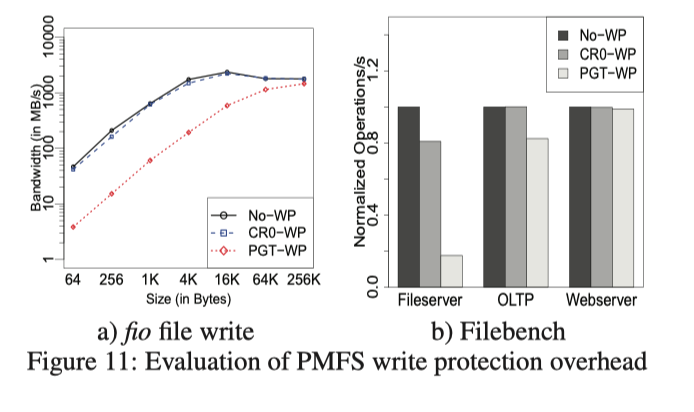

## System Software for Persistent Memory

陶天骅 2017010255

陈张萌 2017013678

### 主要思想

本篇论文写作与2014年，此时NVM刚刚兴起，硬件相对较贵且性能有待发展。此篇论文实现了文件系统：PMFS，它适用于在将来NVM硬件性能较好且价格较便宜，能够使用NVM完全替代SSD和HDD进行大容量存储时的计算机系统。

PMFS是一种轻量级的POSIX文件系统，它利用PM的字节寻址能力来避免面向块的存储的开销，并允许应用程序（具有内存映射的I / O）直接进行PM访问。PMFS同时支持现有的管理内存方式和管理存储方式：既支持字节访问又支持块访问。

论文假设了一个硬件原语：将CPUcache中存储的内容刷新到PM的过程是一个原子操作，不会被中途打断。在本篇文章当中，允许软件发出命令强制刷新。PMFS只依赖这个硬件原语就可以保证其正确性。也正是因此，对PMFS来说cache的写回能力至关重要。

最后，PMFS使用的操作系统现有功能和在文件系统中实现的轻量级读写锁来保护PM免受误写，从而提高可靠性。

由于论文写作时间较早，真实的硬件不足，因此本文使用DRAM搭建了PM模拟器平台，实现了对PM延迟、带宽的模拟。和传统文件系统相比，PMFS显示出显着（高达一个数量级）的增益，证明了为PM优化系统软件的好处。

总之，PMFS在设计和实现上实现了很多优点：

1. 支持旧版应用程序，完全符合POSIX的文件系统接口。
2. 针对支持字节寻址的存储PM作出了优化，最大程度上防止了写扩大。
3. 对内存映射I / O进行了优化
4. 允许应用直接访问PM

### 文件系统结构

文章假设在安装PM的计算机系统中，使用PM完全替代了SSD和HDD用于持久化存储。为了提高性能和简化操作，PMFS在安装时将整个PM映射到内核虚拟地址空间。论文假设了一个硬件原语：从CPUcache到PM的flush过程是一个原子操作，不会被中途打断。该原语可以保证已经从CPUCache中清除的内容，一定已经被成功写入PM。只要该硬件原语可以实现，PMFS的正确性就能够得到保证。因此对于使用PMFS的计算机来说，Cache的写回能力至关重要。

经过测试发现，当Cache使用写回策略时，使用PM作为存储可以获得比较好的性能；而当Cache使用写直达策略时，性能会较多地受到PM性能的影响。因此，Cache使用写回策略，而PMFS负责跟踪PM中的dirty缓存行。同时，PMFS还负责保证写操作的有序性，也就是说：假设有两串写操作A和B，那么PM软件会先对A执行写回操作，在确保它已经完成了可持久化后，再对B执行写回操作。

PMFS中的数据和元数据都是使用B树来组织的，其中元数据是B树的内部节点，数据是B树的叶子结点。相比传统的B树，PMFS中对B树的合并和分裂策略稍做了修改。PMFS中的空间分配基于page，并支持所有处理器页面大小（4KB，2MB，1GB），以实现透明的大页面支持。默认情况下，分配器使用4KB页面作为数据文件B树的元数据（内部）节点，但是数据（叶）节点可以为4KB，2MB或1GB。

内存映射的I / O（mmap）：PMFS中的mmap将文件数据直接映射到应用程序的虚拟地址空间，因此用户可以直接访问PM。 PMFS的mmap会根据mmap和文件数据节点的大小透明地选择最大的硬件页表映射。

文件系统对计算机系统的其他部分也有要求：一是Cache采取写回策略；二是编译器不能打乱写的顺序。

### 如何保证一致性

在PMFS中，对文件系统的每个系统调用都是原子操作，但通过mmap直接访问PM的应用程序必须自行管理文件内容的一致性。现代文件系统通常使用以下几种方法保持一致性：CoW，logging。log-strucured updates.

Cow方式和log-strucured updates要求block或segment粒度（通常是4kb或者更大）。因此，这两种方式通常伴随着写扩大。由于元数据通常的更新都是几个字节，因此当它们用于保持元数据的一致性时，写扩大现象尤其明显。由于PM允许字节访问，而Journaling方式来记录数据更新，可以采用一个更小的粒度，因此在PM中记录小更改数据时（例如元数据）时使用Journaling方式会更合适一些。但是Journaling方式存在缺点：每个更新都需要在日志和文件系统中同时记录。如果一次更新了过大的文件（例如数据文件），就会造成过大的负载；而CoW方式不存在类似的问题。因此在PMFS中将CoW方式和Journal方式结合：元数据使用Journal方式记录，文件使用CoW方式记录。

Journal方式，有两个变种：Undo和Redo。Redo：新数据先被记录在log当中并实现持久化后，再记录进文件系统；Undo策略：在修改前，将旧数据使用log记录；然后将新数据写入旧数据原先的位置。如果操作没有做完系统发生崩溃，那么可以根据旧数据的log进行恢复。在PMFS中，使用Undo方式。

#### 元数据和数据如何保持一致性

元数据更新的过程是这样的：在一系列写操作到来时，PMFS先为它分配很大一块空间，用来存储元数据的log表项。当元数据被修改时，使用Undo方式记录log。当一系列写操作全部完成时（log全部记录完成时），则将所有的改动保存到原来的文件系统当中，并实现持久化。当一次写操作的所有log表项都实现持久化之后，这次写操作会有一个commit id，这时该次写操作才能算完成。为了确保用户希望按照A、B的顺序写入的数据，放在cacheline当中的时候也是顺序的，为此需要在编译器层面，确保写的顺序不会被打乱。

在元数据的一系列写操作完成持久化之后，就可以对log进行垃圾回收操作。在PMFS的每一个log表项中，会记录该log的id，它和时间相关，因此可以据此自动对已经失效的log进行垃圾回收：这个回收是一个新的log cleaner线程周期性进行的。对于每一个log表项来说，log的id会在表项的其他部分已经实现持久化之后，再进行写入。由于硬件原语的假设，写入一条log表项的过程是原子操作。

对于文件系统的文件信息，PMFS可以保证在元数据进行持久化操作之前，数据已经完成了持久化。这样就可以保证，文件系统能访问到的数据都是有效的。

#### 如果遇到系统崩溃

如果遇到系统崩溃的情况，可以在下次启动时候，通过扫描所有的log对文件系统进行恢复。在扫描过程中，如果发现没有commit成功的transaction，文件系统就会回滚到最近一次提交成功的状态。

文件系统空间的分配器也同理，如果遇到机器崩溃的情况，那么再次启动时，PMFS会根据扫描文件系统的B树结果来恢复分配器的状态。如果机器正常结束，那么在结束前PMFS会把当前分配器状态保存在一个inode里。

### 写保护

在以上表格中，每一行表示不同的地址空间，每一列表示不同的特权级。

1. 在用户态下对其他进程的地址空间进行访问，由于每个进程之间的地址空间是独立的，因此不会实现
2. 由于特权级控制，用户态下无法实现对文件系统内核空间的访问
3. 由于SMAP机制，在内核态下也无法对进程的地址空间进行访问
4. 需要实现的是内核态下对内核地址空间的访问，在这里PMFS实现了一个轻量级的读写锁。

### 模拟

由于论文写作时间较早，真实的硬件不足，因此本文使用DRAM搭建了PM模拟器平台，实现了对PM延迟、带宽的模拟。在该平台上，测试了一系列常用操作，用PMFS和加了PM组件的EXT2和EXT4对比，结果如下图所示。

在除rm-r之外的所有测试中，PMFS均比ext2和ext4都快。

由于没有日记相关的开销，对于某些元数据密集型操作，Ext2比ext4快70％。出于同样的原因，对于rm-r，ext2比PMFS快20％。

除了性能测试，在一致性，写保护测试中，文章称PMFS同样表现出色。

